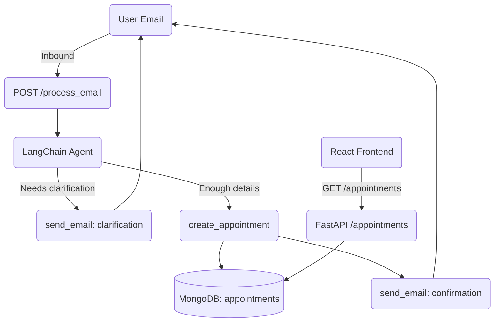

# Bookly

Bookly is a simple appointment management system powered by FastAPI, LangChain, and React.

## Features

- Process incoming emails to either request clarification or schedule an appointment automatically.
- Store appointments in MongoDB.
- Send transactional emails via SendGrid - Log them in meantime.
- React frontend to interact with the backend.

## Prerequisites

1. **Python 3.10+**
2. **Node.js 18+**
3. **MongoDB** running locally or remotely.

## Backend Setup

```bash
cd backend
python -m venv .venv
source .venv/bin/activate
pip install -r requirements.txt
```

Create a `.env` file in `backend/` with:

```env
OPENAI_API_KEY=your_openai_key
SENDGRID_API_KEY=your_sendgrid_key
BOOKLY_FROM_EMAIL=no-reply@yourdomain.com
MONGODB_URI=mongodb://localhost:27017
```

Run the backend:

```bash
uvicorn main:app --reload
```

## Frontend Setup

```bash
cd ../frontend
npm install
npm start
```

The React app will open at `http://localhost:3000` and expects the backend at `http://localhost:8000`.


### Manual Testing with Sample Emails

Below are two example emails that illustrate the primary behaviours of Bookly. You can copy-paste them into the `email_text` payload when calling the `/process_email` endpoint.

#### Scenario 1 — Clear appointment request *(Bookly should create the appointment)*

```text
Subject: Haircut appointment on 25 July 2024

Hi Bookly team,

I’d like to book a haircut on Thursday **25 July 2024 at 14:30** with Ana. Please confirm the booking.

Thanks,
John Doe
```

#### Scenario 2 — Ambiguous request *(Bookly should ask for clarification)*

```text
Subject: Appointment next week

Hello,

I need to see Dr Smith sometime next week for a follow-up. Could you let me know what times are available?

Best regards,
Mary Jones
```

---

#### How to test with these emails

1. Make sure the backend is running (see *Backend Setup* above):

   ```bash
   cd backend
   uvicorn main:app --reload
   ```

2. In a new terminal, send one of the sample emails to the `/process_email` endpoint. Replace `EMAIL_CONTENT` with either of the blocks above and adjust `SENDER_EMAIL` if desired.

   Using `curl`:

   ```bash
   curl -X POST http://localhost:8000/process_email \
        -H "Content-Type: application/json" \
        -d '{"email_text": "EMAIL_CONTENT", "sender_email": "john@example.com"}'
   ```

   • **Scenario 1** should return a JSON message indicating that the appointment was created.
   • **Scenario 2** should return a JSON message containing the clarification email that Bookly sent back to the requester.

3. (Optional) Open http://localhost:3000 in the browser to view appointments created by Scenario 1.

## System Flow Diagram



## Folder Structure

```
Bookly
├── backend
│   ├── main.py
│   ├── database.py
│   ├── email_service.py
│   ├── langchain_agent.py
│   └── requirements.txt
└── frontend
    ├── package.json
    └── src/
        ├── App.js
        └── ...
```

---


## Future Work

Bookly is currently a lightweight proof-of-concept. If development continues, the following milestones would add the most value:

1. **Full Email Webhook Integration** – Receive inbound mail via provider webhooks (SendGrid, SES, Mailgun) while keeping outbound email provider-agnostic.
2. **Calendar Sync Tool** – Introduce a `create_calendar_event` agent tool for Google, Outlook, or CalDAV; attach .ics invites in confirmation emails.
3. **Background Jobs & Periodic Sync** – Off-load long-running email/calendar calls to a worker queue and run periodic jobs to reconcile data.
4. **OAuth & Secrets Management** – Securely store and refresh user tokens for external APIs.
5. **UI Enhancements** – Surface calendar links and appointment status directly in the React frontend.

These steps would evolve Bookly into a fully integrated assistant that triages email requests, books real calendar events, and keeps everyone automatically informed.

--- 